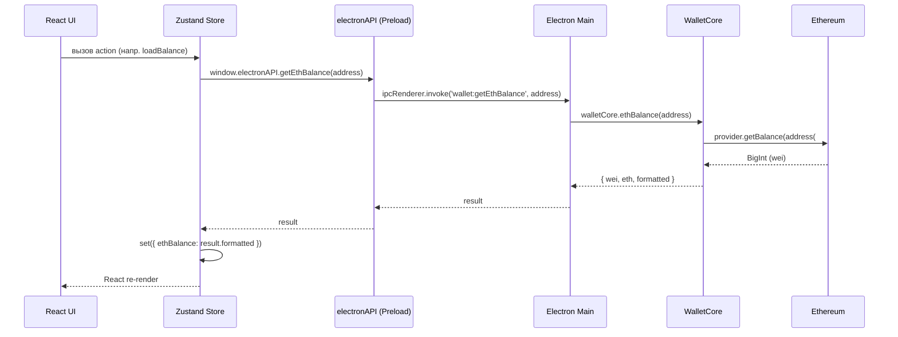
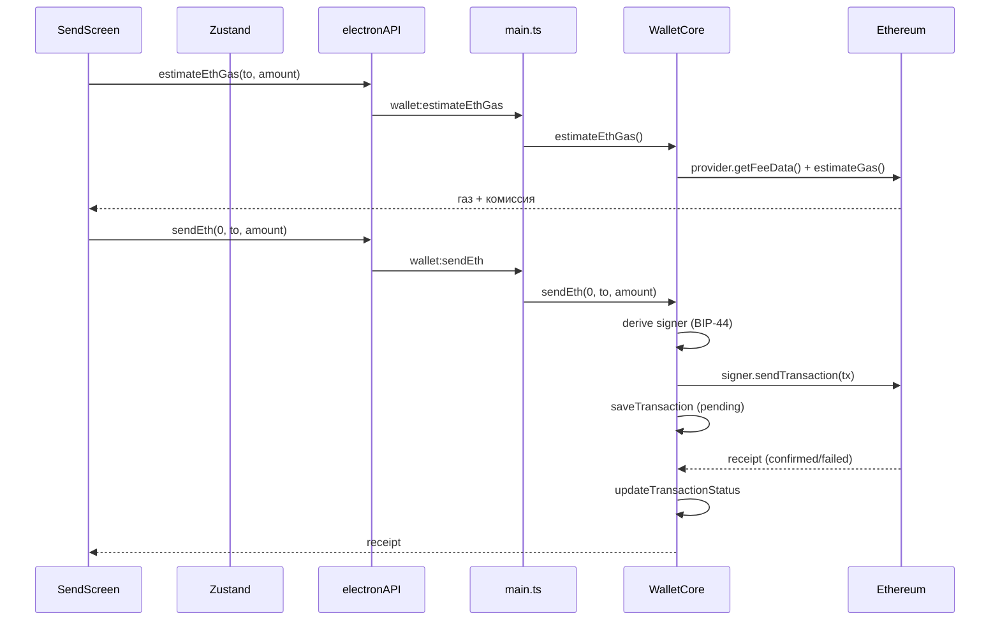
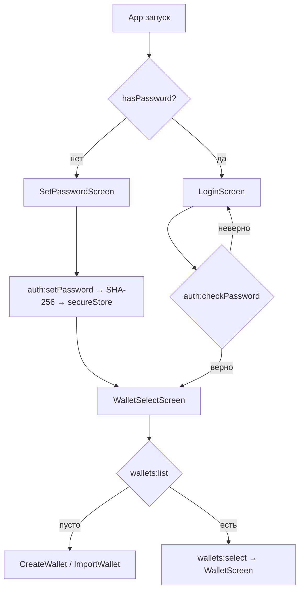

# Поток данных

**Раздел:** [[architecture/_index|Архитектура]] · **Главная:** [[_index]]

---

## Обзор

Данные в EVM Wallet проходят через 4 слоя. Renderer (React) **никогда** не имеет прямого доступа к Node.js или файловой системе — всё проходит через IPC.

## Основной поток



## Поток отправки ETH



## Поток аутентификации



## Поток мульти-кошелька

1. **Создание:** `wallets:create(name)` → `WalletCore.ensureSeed(true)` → генерация BIP-39 → сохранение в `wallets_v1` → `address(0)`
2. **Импорт:** `wallets:import(name, seed)` → `WalletCore.importSeed(seed)` → проверка дубликатов по адресу → сохранение
3. **Переключение:** `wallets:select(id)` → чтение seed из `wallets_v1` → `importSeed` → смена `active_wallet_id`
4. **Удаление:** `wallets:delete(id)` → удаление из JSON → если активный — очистка seed из памяти

## Хранение данных

```
UserData/
└── secure-store.json          # Зашифрованный JSON (Electron safeStorage)
    ├── app_password_hash      # SHA-256 хеш пароля
    ├── wallets_v1             # JSON: [{id, name, seedPhrase, address, createdAt}]
    ├── active_wallet_id       # ID текущего кошелька
    ├── seed_v1                # JSON: {phrase} — текущий seed в памяти WalletCore
    └── transactions_v1        # JSON: [{hash, from, to, value, ...}]
```

> ⚠️ `seedPhrase` хранится **зашифрованным** через `safeStorage` (OS Keychain). Подробнее: [[architecture/security|Безопасность]]

---

## См. также

- [[backend/ipc-reference|Справочник IPC]] — полный список каналов
- [[frontend/store|Zustand Store]] — state и actions
- [[architecture/security|Безопасность]] — модель шифрования
- [[packages/wallet-core|wallet-core]] — API класса WalletCore
