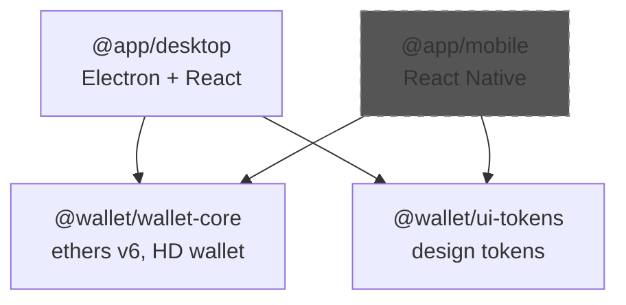

# Монорепо

**Раздел:** [[architecture/_index|Архитектура]] · **Главная:** [[_index]]

---

## Структура

EVM Wallet использует **pnpm 9.6.0** workspaces. Все пакеты живут в одном репозитории.

```yaml
# pnpm-workspace.yaml
packages:
  - "apps/*"
  - "packages/*"
```

## Пакеты и зависимости



> `@app/mobile` пунктиром — проект существует, но Android pipeline отключён.

## Таблица пакетов

| Пакет | Путь | Build tool | Основные зависимости |
|-------|------|-----------|---------------------|
| `@wallet/wallet-core` | `packages/wallet-core/` | tsup | ethers ^6.8, cross-fetch |
| `@wallet/ui-tokens` | `packages/ui-tokens/` | tsup | — (zero runtime deps) |
| `@app/desktop` | `apps/desktop/` | esbuild (main) + Vite (renderer) | electron ^25, react ^18, zustand ^4, tailwindcss ^3 |
| `@app/mobile` | `apps/mobile/` | Metro | react-native 0.74 |

## Workspace Protocol

Desktop-приложение подключает shared-пакеты через `workspace:*`:

```json
{
  "dependencies": {
    "@wallet/wallet-core": "workspace:*",
    "@wallet/ui-tokens": "workspace:*"
  }
}
```

## Порядок сборки

```
1. pnpm install                              # Установка зависимостей
2. pnpm -F @wallet/wallet-core build         # tsup → dist/index.js + .d.ts
3. pnpm -F @wallet/ui-tokens build           # tsup → dist/index.js + .d.ts
4. pnpm -F @app/desktop build:main           # esbuild → dist/main.js + preload.js
5. pnpm -F @app/desktop build:renderer       # vite → dist/renderer/
6. electron-builder                           # → release/win-unpacked/ + .exe
```

> ⚠️ Шаги 2-3 обязательны перед 4-5, т.к. desktop импортирует `dist/` артефакты.

## Скрипты корневого package.json

| Скрипт | Команда |
|--------|---------|
| `desktop:dev` | `pnpm -F @app/desktop dev` |
| `desktop:build` | `pnpm -F @app/desktop build` |
| `typecheck` | `pnpm -r typecheck` |
| `test` | `pnpm -F @app/desktop test` |

## Настройки

```ini
# .npmrc
shamefully-hoist=true    # Необходимо для Electron — некоторые native модули
                         # ожидают плоскую структуру node_modules
```

---

## См. также

- [[architecture/overview|Обзор архитектуры]] — общая схема
- [[packages/_index|Пакеты]] — API wallet-core и ui-tokens
- [[devops/ci-pipeline|CI Pipeline]] — как CI использует build order
