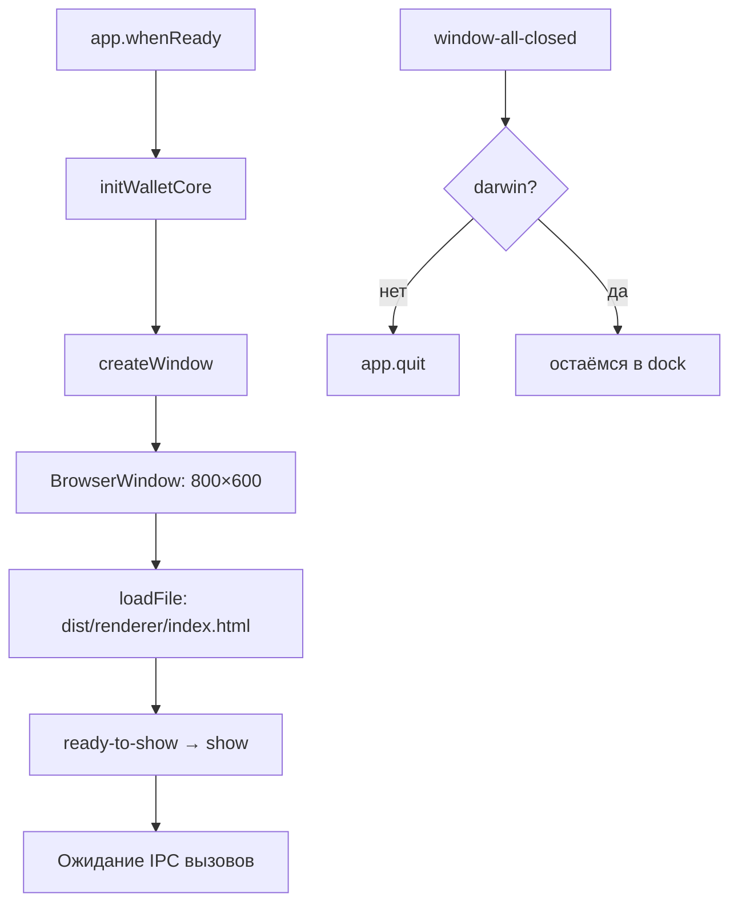

# Electron Main Process

**Раздел:** [[backend/_index|Backend]] · **Главная:** [[_index]]

---

## Файл

`apps/desktop/src/backend/main.ts` (236 строк)

## Жизненный цикл



## Настройки BrowserWindow

```typescript
new BrowserWindow({
  width: 800,
  height: 600,
  minWidth: 600,
  minHeight: 500,
  icon: join(__dirname, '..', 'assets', 'icon.png'),
  webPreferences: {
    nodeIntegration: false,        // ← безопасность
    contextIsolation: true,        // ← безопасность
    preload: join(__dirname, 'preload.js'),
  },
  title: 'EVM Wallet',
  show: false                      // показываем только после ready-to-show
})
```

## Инициализация WalletCore

```typescript
const rpcUrl = process.env.ALCHEMY_RPC_MAINNET
           || process.env.INFURA_RPC_MAINNET
           || 'https://ethereum.publicnode.com'    // fallback

walletCore = new WalletCore(rpcUrl, secureStore, etherscanApiKey)
```

Приоритет RPC: Alchemy → Infura → PublicNode (бесплатный).

## Ключевые константы

| Константа | Значение | Назначение |
|-----------|---------|-----------|
| `PASSWORD_KEY` | `app_password_hash` | Ключ для хеша пароля в secure store |
| `WALLETS_KEY` | `wallets_v1` | Массив кошельков |
| `ACTIVE_WALLET_KEY` | `active_wallet_id` | ID активного кошелька |

## Зарегистрированные IPC-хендлеры

Все хендлеры описаны в [[backend/ipc-reference|Справочнике IPC]].

Группы:
- `auth:*` — 3 хендлера (аутентификация)
- `wallets:*` — 6 хендлеров (мульти-кошелёк)
- `wallet:*` — 14 хендлеров (операции с кошельком)

---

## См. также

- [[backend/preload|Preload]] — как хендлеры экспортируются в renderer
- [[backend/secure-store|Secure Store]] — хранилище, которое использует main.ts
- [[architecture/security|Безопасность]] — почему такие настройки BrowserWindow
