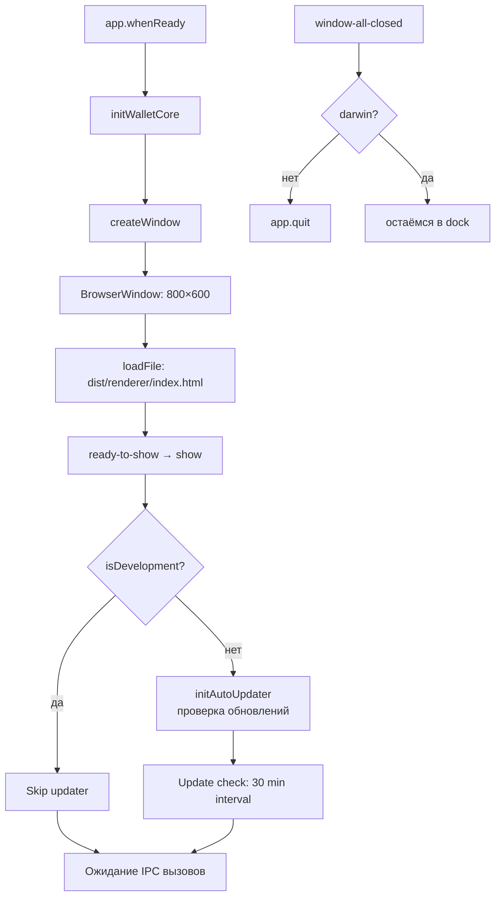

# Electron Main Process

**Раздел:** [[backend/_index|Backend]] · **Главная:** [[_index]]

---

## Файл

`apps/desktop/src/backend/main.ts` (~336 строк)

## Жизненный цикл



## Настройки BrowserWindow

```typescript
new BrowserWindow({
  width: 800,
  height: 600,
  minWidth: 600,
  minHeight: 500,
  icon: join(__dirname, '..', 'assets', 'icon.png'),
  webPreferences: {
    nodeIntegration: false,        // ← безопасность
    contextIsolation: true,        // ← безопасность
    preload: join(__dirname, 'preload.js'),
  },
  title: 'EVM Wallet',
  show: false                      // показываем только после ready-to-show
})
```

## Инициализация WalletCore

```typescript
import log from 'electron-log'
import fetch from 'cross-fetch'
import { WalletCore } from '@wallet/wallet-core'

const rpcUrl = process.env.ALCHEMY_RPC_MAINNET
           || process.env.INFURA_RPC_MAINNET
           || 'https://ethereum.publicnode.com'    // fallback

const etherscanApiKey = process.env.ETHERSCAN_API_KEY
const incomingTokenWhitelist = (process.env.INCOMING_ERC20_WHITELIST || '')
  .split(',').map(a => a.trim()).filter(Boolean)

walletCore = new WalletCore(
  rpcUrl,
  secureStore,
  etherscanApiKey,
  incomingTokenWhitelist.length > 0 ? incomingTokenWhitelist : undefined,
  log                      // ← injectable logger (electron-log)
)
```

Приоритет RPC: Alchemy → Infura → PublicNode (бесплатный).

### Логирование (v1.1.6+)

Мain process использует `electron-log` — логи пишутся в:
- `%APPDATA%/@app/desktop/logs/main.log` (файл)
- Console (для `npm run dev`)

`WalletCore` получает `electron-log` как `WalletLogger`, поэтому все `[WalletCore:getIncoming]` логи видны в main.log.

## Инициализация Auto-Updater

После создания окна инициализируется система обновлений (только в production):

```typescript
// В app.whenReady():
if (!isDevelopment && mainWindow) {
  initAutoUpdater(mainWindow)
}
```

**File:** `apps/desktop/src/backend/auto-updater.ts`

**Возможности:**
- ✅ Проверка обновлений при старте
- ✅ Периодическая проверка (каждые 30 минут)
- ✅ Диалоги пользователю (скачать? перезагрузить?)
- ✅ Прогресс-бар (taskbar + IPC к renderer)
- ✅ Логирование всех событий

Подробнее: [[devops/auto-update|Система авто-обновлений]].

## Ключевые константы

| Константа | Значение | Назначение |
|-----------|---------|-----------|
| `PASSWORD_KEY` | `app_password_hash` | Ключ для хеша пароля в secure store |
| `WALLETS_KEY` | `wallets_v1` | Массив кошельков |
| `ACTIVE_WALLET_KEY` | `active_wallet_id` | ID активного кошелька |

## Зарегистрированные IPC-хендлеры

Все хендлеры описаны в [[backend/ipc-reference|Справочнике IPC]].

Группы:
- `auth:*` — 3 хендлера (аутентификация)
- `wallets:*` — 6 хендлеров (мульти-кошелёк)
- `wallet:*` — 16 хендлеров (операции + диагностика: `getDiagnostics`, `testEtherscan`)

---

## См. также

- [[backend/auto-updater|Auto-Updater]] — electron-updater интеграция
- [[backend/preload|Preload]] — как хендлеры экспортируются в renderer
- [[backend/secure-store|Secure Store]] — хранилище, которое использует main.ts
- [[devops/auto-update|Авто-обновления]] — клиентская сторона (DevOps)
- [[architecture/security|Безопасность]] — почему такие настройки BrowserWindow
