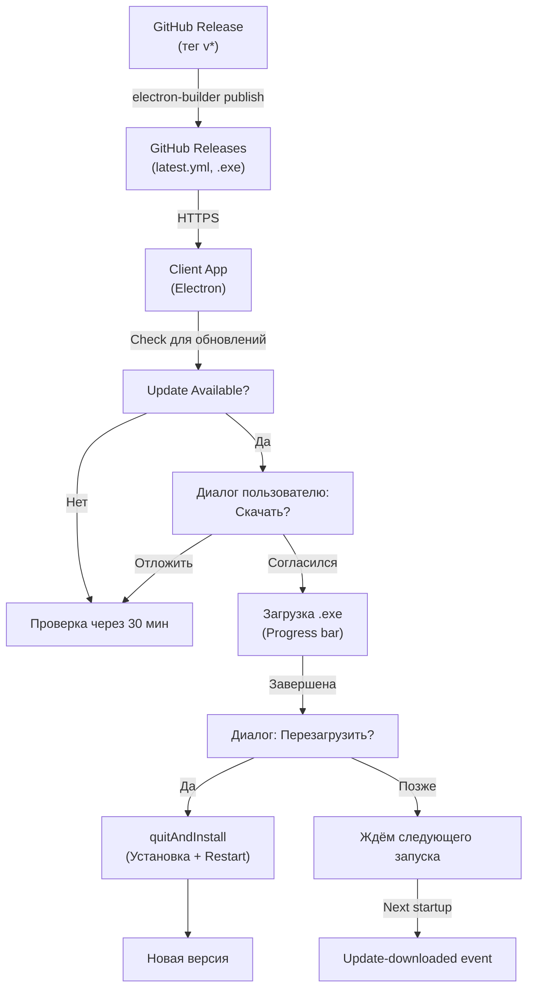

# Auto-Update System

**Раздел:** [[devops/_index|DevOps]] · **Главная:** [[_index]]

---

## Описание

Система автоматических обновлений для EVM Wallet позволяет пользователям получать новые версии приложения без ручной переустановки. При создании GitHub Release с тегом типа `v*` приложение у клиентов автоматически обнаруживает обновление, предлагает скачать и установить новую версию.

Основана на [[https://www.electron.build/auto-update|electron-updater]] и [[https://www.npmjs.com/package/electron-log|electron-log]].

## Архитектура



## Компоненты

### 1. Auto-Updater Module
**Файл:** `apps/desktop/src/backend/auto-updater.ts`

Управляет жизненным циклом обновлений:
- **Инициализация:** При старте приложения (только в production)
- **Первая проверка:** Сразу при `app.whenReady()`
- **Периодическая проверка:** Каждые 30 минут
- **Обработчики событий:**
  - `update-available` — показать диалог с предложением
  - `download-progress` — отправить прогресс в renderer + taskbar
  - `update-downloaded` — показать диалог о перезагрузке
  - `error` — залогировать без крэша

```typescript
import { initAutoUpdater } from './auto-updater'

// В main.ts, app.whenReady():
if (!isDevelopment && mainWindow) {
  initAutoUpdater(mainWindow)
}
```

### 2. Build Configuration
**Файлы:** 
- `apps/desktop/electron-builder-nosign.json`
- `apps/desktop/package.json` (build block)

Publish configuration для GitHub:
```json
"publish": {
  "provider": "github",
  "owner": "alexander-shmidt14",
  "repo": "EVM-wallet"
}
```

**Примечание:** Репозиторий публичный — токен в конфиге не нужен. При публикации релизов (тег `v*`) `GH_TOKEN` передаётся через переменную окружения в GitHub Actions (`secrets.GITHUB_TOKEN`), electron-builder подхватывает его автоматически.

### 3. GitHub Actions Workflow
**Файл:** `.github/workflows/windows-build.yml`

При push тега `v*` workflow автоматически добавляет `--publish always`:
```bash
npx electron-builder --win nsis \
  --config electron-builder-nosign.json \
  --publish always
```

Флаг `--publish always` активирует:
1. Сборку NSIS installer
2. Генерацию `latest.yml` (метаданные для updater)
3. Загрузку `.exe` и `latest.yml` в GitHub Release

**Переменная окружения** (передаётся через env в workflow, не в конфиге):
```yaml
env:
  GH_TOKEN: ${{ secrets.GITHUB_TOKEN }}
```

### 4. IPC Event (Optional: для UI-прогресса)
**Файл:** `apps/desktop/src/backend/preload.ts`

В preload тип `ElectronAPI` расширен методом:
```typescript
onUpdateProgress: (callback: (progress: { percent: number }) => void) => {
  ipcRenderer.on('update-progress', (_, progress) => callback(progress))
  return () => ipcRenderer.removeAllListeners('update-progress')
}
```

Использование в React:
```typescript
useEffect(() => {
  const unsubscribe = window.electronAPI.onUpdateProgress(({ percent }) => {
    console.log(`Download: ${percent}%`)
  })
  return unsubscribe
}, [])
```

## Flow обновления у клиента

### Сценарий 1: Обновление найдено
1. Приложение проверяет `https://github.com/alexander-shmidt14/EVM-wallet/releases/latest`
2. Парсит `latest.yml` → находит новую версию
3. **Диалог:** "Доступна версия X.Y.Z. Скачать?"
   - [Скачать] → начинается загрузка
   - [Потом] → проверка через 30 минут
4. Во время загрузки:
   - Прогресс-бар на taskbar (0-100%)
   - Событие `update-progress` в renderer (опционально)
5. При завершении:
   - **Диалог:** "Обновление готово. Перезагрузить сейчас?"
   - [Перезагрузить] → `autoUpdater.quitAndInstall()` → install + restart
   - [Позже] → обновление установится при следующем запуске

### Сценарий 2: Обновление недоступно
- Логируется "No update available"
- Проверка повторяется через 30 минут

### Сценарий 3: Ошибка
- Ошибка залогируется в electron-log
- **Диалог:** "Ошибка при проверке обновлений"
- Приложение продолжает работу нормально (не крашится)

## Версионирование

**Синхронизация 1:1:**
- GitHub Release тег: `v1.1.0`
- `apps/desktop/package.json` version: `1.1.0`

При несовпадении updater может не распознать обновление.

**Проверка перед build:**
```bash
# 1. Обновить версию в package.json
# 2. Закоммитить
# 3. Создать тег
git tag v1.1.0
git push origin v1.1.0

# GitHub Actions сам запустится на tag
```

## Логирование

Все события логируются в `electron-log`:

```
[2026-03-03 14:52:10.123] [info] Initializing auto-updater
[2026-03-03 14:52:11.456] [info] Update available: 1.1.0 (currentVersion: 1.0.0, newVersion: 1.1.0)
[2026-03-03 14:52:12.789] [info] User accepted update, starting download
[2026-03-03 14:52:13.012] [info] Download progress: 25%
[2026-03-03 14:52:25.345] [info] Download progress: 100%
[2026-03-03 14:52:26.678] [info] Update downloaded successfully (version: 1.1.0)
[2026-03-03 14:52:27.901] [info] Quitting and installing update
```

Логи сохраняются в:
- **Windows:** `%APPDATA%/EVM Wallet/logs/main.log`
- **macOS:** `~/Library/Logs/EVM Wallet/main.log`
- **Linux:** `~/.config/EVM Wallet/logs/main.log`

## Troubleshooting

### Обновление не предлагается
- ✅ Проверить версию в `latest.yml` > текущей версии app
- ✅ Проверить подключение к интернету
- ✅ Открыть логи в `%APPDATA%/EVM Wallet/logs/main.log`
- ✅ Перезапустить приложение

### Скачивание зависает
- ✅ Проверить интернет-соединение
- ✅ Проверить GitHub Release файлы (`.exe` и `latest.yml` на месте)
- ✅ Проверить место на диске

### Установка не начинается
- ✅ Закрыть все окна приложения перед нажатием "Перезагрузить"
- ✅ Проверить права на запись в `$LOCALAPPDATA`

### Тестирование локально
Невозможно тестировать автоматическое обновление в dev-режиме (GitHub Release недоступны в development). Для тестирования:
1. Собрать packaged версию: `npm run dist`
2. Установить версию 1.0.0
3. Создать Release v1.1.0 в GitHub
4. Запустить 1.0.0 → проверить наличие диалога

## См. также

- [[devops/release|Релиз]] — тегирование и процесс релиза
- [[devops/windows-build|Windows Build]] — CI/CD для сборки
- [[backend/electron-main|Electron Main]] — инициализация main process
