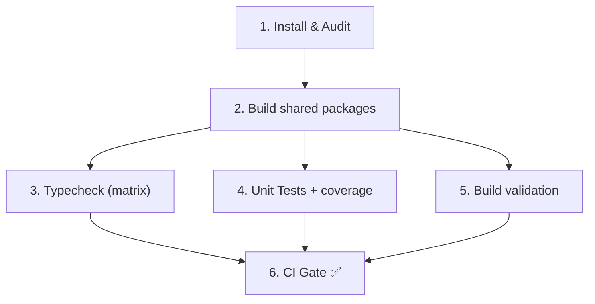

# CI Pipeline

**Раздел:** [[devops/_index|DevOps]] · **Главная:** [[_index]]

---

## Файл

`.github/workflows/ci.yml`

## Триггеры

- **PR** → `dev`, `staging`, `main`
- **Push** → `dev`, `staging`, `main`

## Concurrency

```yaml
group: ci-${{ github.ref }}
cancel-in-progress: true
```

Параллельные запуски на одной ветке отменяются — остаётся последний.

## Шаги (Jobs)



### 1. Install & Audit

- `pnpm install --frozen-lockfile`
- `pnpm audit --audit-level=high` (non-blocking)
- Кеширование: `deps-${{ runner.os }}-${{ hashFiles('pnpm-lock.yaml') }}`

### 2. Build shared packages

- `pnpm -F @wallet/wallet-core build` → проверка `dist/index.js` + `dist/index.d.ts`
- `pnpm -F @wallet/ui-tokens build` → проверка `dist/index.js`
- Кеш: `packages-${{ github.sha }}`

### 3. Typecheck (matrix)

Матрица: `@wallet/wallet-core` и `@app/desktop`

```yaml
strategy:
  fail-fast: false
  matrix:
    package: ["@wallet/wallet-core", "@app/desktop"]
```

### 4. Unit Tests + coverage

- `pnpm -F @app/desktop test -- --passWithNoTests --ci --coverage --verbose`
- Артефакт: `coverage-report-${{ github.sha }}` (14 дней)

### 5. Build validation

- `build:main` (esbuild → `dist/main.js`)
- `build:renderer` (vite → `dist/renderer/`)
- Проверка: `main.js`, `preload.js`, `renderer/`, `renderer/index.html`

### 6. CI Gate

**Единственный обязательный check для merge.** Проходит только если все 5 предыдущих jobs — `success`.

```yaml
ci-gate:
  if: always()
  needs: [install, build-packages, typecheck, test, build-check]
```

Если хоть один job упал → `exit 1` → merge заблокирован.

---

## См. также

- [[devops/windows-build|Windows Build]] — автосборка .exe после merge
- [[devops/branching|Git-стратегия]] — как PR и merge связаны с CI
- [[architecture/monorepo|Монорепо]] — build order пакетов
