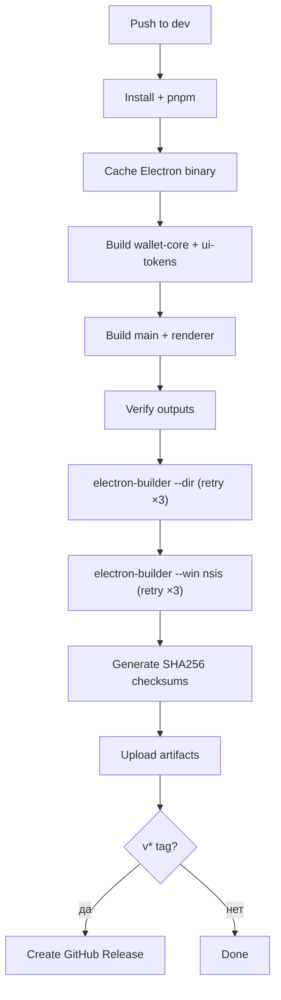

# Windows Build

**Раздел:** [[devops/_index|DevOps]] · **Главная:** [[_index]]

---

## Файл

`.github/workflows/windows-build.yml`

## Триггеры

| Событие | Условие |
|---------|---------|
| `push` | Ветки: `dev`, `staging`, `main` |
| `push tags` | `v*` (для GitHub Release) |
| `workflow_dispatch` | Ручной запуск, выбор `dir` / `nsis` |

## Как работает



## Electron binary cache

```yaml
- name: Cache Electron
  uses: actions/cache@v4
  with:
    path: ~/AppData/Local/electron/Cache
    key: electron-${{ runner.os }}-${{ hashFiles('apps/desktop/package.json') }}
    restore-keys: electron-${{ runner.os }}-
```

Кеширует скачанный `electron-v25.9.8-win32-x64.zip` (~100MB). Экономит ~30–60 сек на каждом билде.

## Retry логика

Оба шага electron-builder обёрнуты в PowerShell retry-цикл (3 попытки, 15 сек между ними):

```powershell
$maxRetries = 3
for ($i = 1; $i -le $maxRetries; $i++) {
    npx electron-builder --dir --config electron-builder-nosign.json
    if ($LASTEXITCODE -eq 0) { break }
    if ($i -lt $maxRetries) { Start-Sleep -Seconds 15 }
    else { exit 1 }
}
```

Причина: transient network EOF при скачивании Electron.

## Unsigned build

Используется `electron-builder-nosign.json`:
- `"sign": null`
- `"forceCodeSigning": false`
- `CSC_IDENTITY_AUTO_DISCOVERY=false`

## Артефакты

| Артефакт | Содержимое | Срок хранения |
|----------|-----------|---------------|
| `EVM-Wallet-win-unpacked-*` | `release/win-unpacked/` | 30 дней |
| `EVM-Wallet-Setup-*` | `.exe` + `SHA256SUMS.txt` | 90 дней |

## GitHub Release

Создаётся автоматически при push тега `v*`:
- Файлы: `.exe` + checksums
- `generate_release_notes: true`
- `prerelease` для тегов с `-beta` / `-rc`

---

## См. также

- [[devops/ci-pipeline|CI Pipeline]] — runs before merge
- [[devops/release|Релиз]] — полный процесс релиза
- [[architecture/monorepo|Монорепо]] — build order
