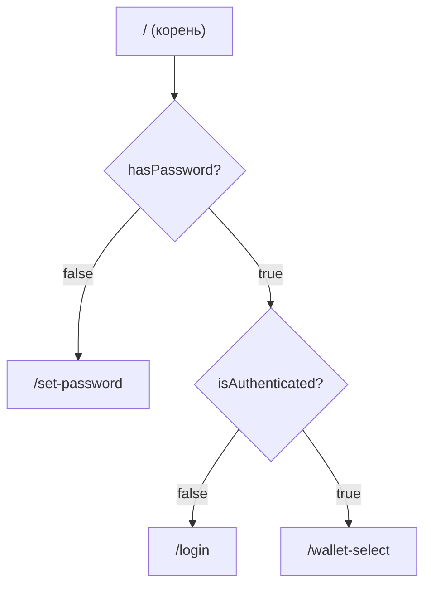
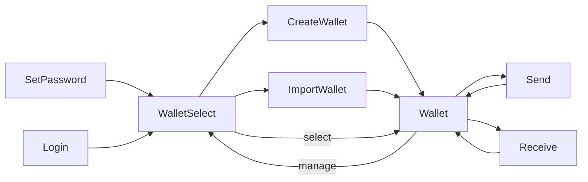

# Маршрутизация и Auth Flow

**Раздел:** [[frontend/_index|Frontend]] · **Главная:** [[_index]]

---

## Router

Используется `HashRouter` из react-router-dom v6. Hash-роутинг необходим для Electron — `file://` протокол не поддерживает browser history.

## Маршруты

| Путь | Компонент | Описание |
|------|-----------|----------|
| `/` | `Navigate` | Редирект на основе auth state |
| `/set-password` | [[frontend/screens/set-password\|SetPasswordScreen]] | Создание пароля (первый запуск) |
| `/login` | [[frontend/screens/login\|LoginScreen]] | Вход по паролю |
| `/wallet-select` | [[frontend/screens/wallet-select\|WalletSelectScreen]] | Выбор / управление кошельками |
| `/create-wallet` | [[frontend/screens/create-wallet\|CreateWalletScreen]] | Создание нового кошелька |
| `/import-wallet` | [[frontend/screens/import-wallet\|ImportWalletScreen]] | Импорт по seed phrase |
| `/wallet` | [[frontend/screens/wallet\|WalletScreen]] | Главный экран кошелька |
| `/receive` | [[frontend/screens/receive\|ReceiveScreen]] | QR-код + адрес для получения |
| `/send` | [[frontend/screens/send\|SendScreen]] | Отправка ETH / ERC-20 |

## Auth Guard



Логика в `AppContent` компоненте:

```typescript
const getDefaultRoute = () => {
  if (!hasPassword) return '/set-password'
  if (!isAuthenticated) return '/login'
  return '/wallet-select'
}
```

## Инициализация

При запуске приложения `AppContent` вызывает `initialize()` из [[frontend/store|store]]:

1. `auth:hasPassword` → проверка наличия пароля
2. `wallet:hasWallet` → проверка наличия seed
3. Если есть wallet → `wallet:getAddress(0)` + загрузка списка кошельков
4. `set({ isInitialized: true })`

Пока `isInitialized === false` — показывается [[frontend/components|Loading]] спиннер.

## Навигация между экранами



---

## См. также

- [[frontend/store|Zustand Store]] — state-зависимости для роутинга
- [[frontend/screens/_index|Все экраны]] — подробное описание каждого
- [[backend/ipc-reference|Справочник IPC]] — `auth:*` каналы
