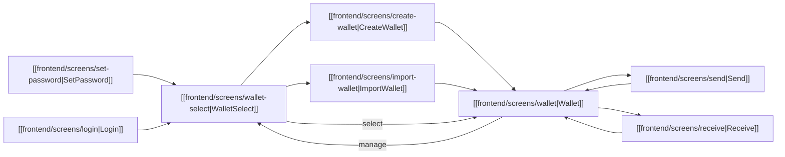

# Экраны

> Все экраны десктопного приложения EVM Wallet.

**Родитель:** [[frontend/_index|Frontend]] · **Главная:** [[_index]]

---

## Карта навигации

## Все экраны

| # | Экран | Маршрут | Описание |
|---|-------|---------|----------|
| 1 | [[frontend/screens/set-password\|SetPassword]] | `/set-password` | Создание пароля приложения |
| 2 | [[frontend/screens/login\|Login]] | `/login` | Вход по паролю |
| 3 | [[frontend/screens/wallet-select\|WalletSelect]] | `/wallet-select` | Список кошельков, переключение, управление |
| 4 | [[frontend/screens/create-wallet\|CreateWallet]] | `/create-wallet` | Создание нового HD-кошелька |
| 5 | [[frontend/screens/import-wallet\|ImportWallet]] | `/import-wallet` | Импорт по seed phrase |
| 6 | [[frontend/screens/wallet\|Wallet]] | `/wallet` | Главный экран: балансы, активы, операции |
| 7 | [[frontend/screens/send\|Send]] | `/send` | Отправка ETH / ERC-20 |
| 8 | [[frontend/screens/receive\|Receive]] | `/receive` | QR-код + адрес для получения |

> `OnboardingScreen.tsx` существует в коде, но **не подключён к Router** — legacy код.

---

## См. также

- [[frontend/app-flow|Маршрутизация]] — auth guard и redirect логика
- [[frontend/store|Zustand Store]] — state, который используют экраны
- [[backend/ipc-reference|Справочник IPC]] — каналы, вызываемые с экранов
